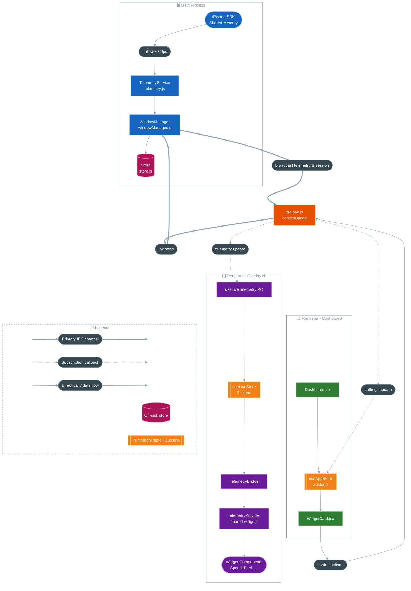

<div align="center">
  <h1>Cold Mirror Client</h1>
  <p>A standalone desktop overlay application for iRacing.</p>

  <p>
    <a href="https://github.com/0resuto/cold-mirror-client/actions/workflows/lint.yml"></a>
    
    <a href="https://github.com/0resuto/cold-mirror-client/releases/latest"></a>
  </p>
  <p>
    
    
    
    
  </p>
</div>

---


## Overview

Cold Mirror Client provides transparent, telemetry widgets (such as Live Standings, Relatives, and Fuel tracking) that overlay directly on top of the iRacing simulator. 

It runs as a fully independent application, reading iRacing shared memory via `irsdk-node` without requiring an external backend or database.

## Architecture

`cold-mirror-widgets` is an Electron app that reads live telemetry from the iRacing SDK in the main process and streams it to a dashboard window plus any number of overlay windows via IPC.



**Data flow, in short:**
1. `TelemetryService` polls the iRacing shared-memory SDK and forwards frames to `WindowManager`.
2. `WindowManager` broadcasts telemetry and session info to every renderer through `preload.js`'s `contextBridge`.
3. The **Dashboard** renderer keeps settings/overlay state in `useAppStore` and sends control actions back through the same bridge.
4. Each **Overlay** renderer consumes the live stream via `useLiveTelemetryIPC` → `useLiveStore` → `TelemetryBridge` → `TelemetryProvider`, which feeds the individual widget components.

## Getting Started

### Prerequisites

- Node.js
- iRacing (running to provide telemetry data)

### Development

1. Install dependencies:
   ```bash
   npm install
   ```

2. Start the development server:
   ```bash
   npm run dev
   ```
   > Launches the Vite development server and the Electron application concurrently.

## Build

Compile executables for distribution:

```bash
npm run build
```
> Outputs are generated in the `dist` and `release` directories.
